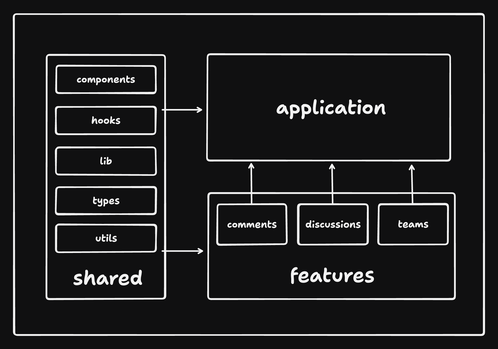

## Project Structure

Project code lives in the src directory:

```sh
/app             # application layer containing:
    .../layouts             # application routes layouts
    .../routes              # application routes
    .../app-provider.tsx    # application provider that wraps the entire application with global providers.
    .../app.tsx             # main application component
/assets          # assets folder can contain all the static files such as images, fonts, etc.
/components      # shared components used across the entire application
/config          # global configurations, exported env variables etc.
/features        # feature based modules
/hooks           # shared hooks used across the entire application
/lib             # reusable libraries preconfigured for the application
/stores          # global state stores
/test            # test utilities and mocks
/shared-types    # shared types used across the application
/utils           # shared utility functions
/mocks           # API calls mocks
```

## Feature structure

For easy scalability and maintenance, organize most of the code within the features folder. Each feature folder should contain code specific to that feature, keeping things neatly separated. This approach helps prevent mixing feature-related code with shared components, making it simpler to manage and maintain the codebase compared to having many files in a flat folder structure.

<span style="color: gray; font-style: italic;">
    NOTE: You don't need all of these folders for every feature. Only include the ones that are necessary for the feature.
    </br></br>
</span>

```sh
/features/awesome-feature    # feature directory
    .../api           # exported API request declarations and api hooks related to a specific feature
    .../assets        # assets folder can contain all the static files for a specific feature
    .../components    # components scoped to a specific feature
    .../hooks         # hooks scoped to a specific feature
    .../stores        # state stores for a specific feature
    .../types         # typescript types used within the feature
    .../utils         # utility functions for a specific feature
```

## Unidirectional Codebase Architecture

Implementing a unidirectional codebase architecture ensures that code flows in one direction, from shared parts of the code to the application.
This is a good practice to follow as it makes the codebase more predictable and easier to understand.

`Shared` → `Application`

`Shared` → `Features` → `Application`



## Enforce Unidirectional Codebase Architecture

```json
  "import/no-restricted-paths": [
    "error",
    {
      "zones": [
        { "target": ["./src/features", "./src/layouts"], "from": "./src/app" },
        {
          "target": [
            "./src/assets",
            "./src/components",
            "./src/config",
            "./src/hooks",
            "./src/lib",
            "./src/mocks",
            "./src/shared-types",
            "./src/utils"
          ],
          "from": ["./src/features", "./src/app"]
        }
      ]
    }
  ]
```

## Forbid cross feature imports

To maintain modular independence within our application, we enforce strict rules against cross-feature imports. This practice ensures that each feature remains self-contained, fostering a cleaner and more organized codebase.

```json
  "import/no-restricted-paths": [
    "error",
    {
      "zones": [
        {
          "target": "./src/features/**/*.tsx",
          "from": "./src/features/**/*.tsx",
          "except": ["**/*.shared.tsx"],
          "message": "To use a feature as a shared component in other features, add the middle extension '.shared' to the filename (e.g., 'feature.shared.tsx')."
        }
      ]
    }
  ]
```

## Enforcing Directory and File Naming Conventions

Enforce strict naming conventions for directories and files using [ls-lint](https://ls-lint.org/).
Ls-lint ensures that all file and directory names in our codebase adhere to a consistent naming convention. This helps keep the project organized and easy to navigate, prevent naming conflicts and errors, and ensure a uniform structure that all team members can easily follow.

```yml
ls:
  .dir: kebab-case # Directories must use kebab-case
  .js: kebab-case # JavaScript files must use kebab-case
  .jsx: kebab-case # JSX files must use kebab-case
  .ts: kebab-case # TypeScript files must use kebab-case
  .tsx: kebab-case # TSX files must use kebab-case
  .d.ts: kebab-case # TypeScript declaration files must use kebab-case
  .shared.tsx: regex:^[a-z0-9]+(?:-[a-z0-9]+)*(?:\.[a-zA-Z0-9-]+)*$ # Regext checks for kebab-case.*
  .css: regex:^[a-z0-9]+(?:-[a-z0-9]+)*(?:\.[a-zA-Z0-9-]+)*$
```
